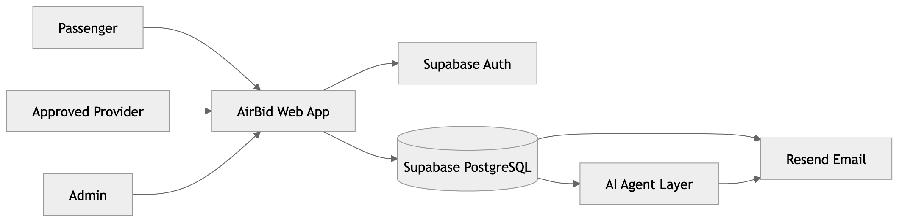
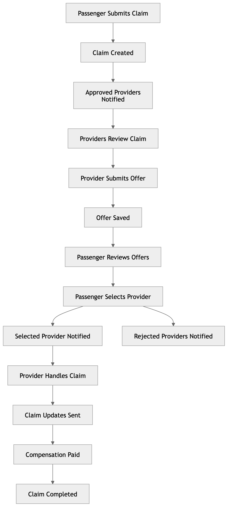
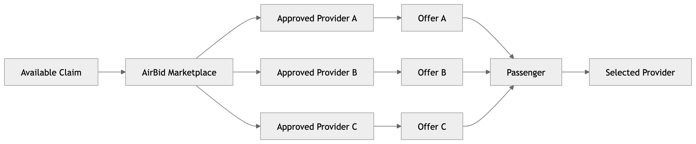
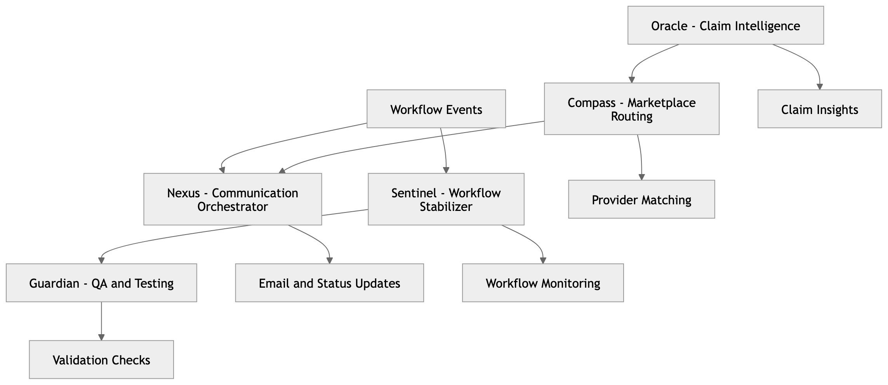
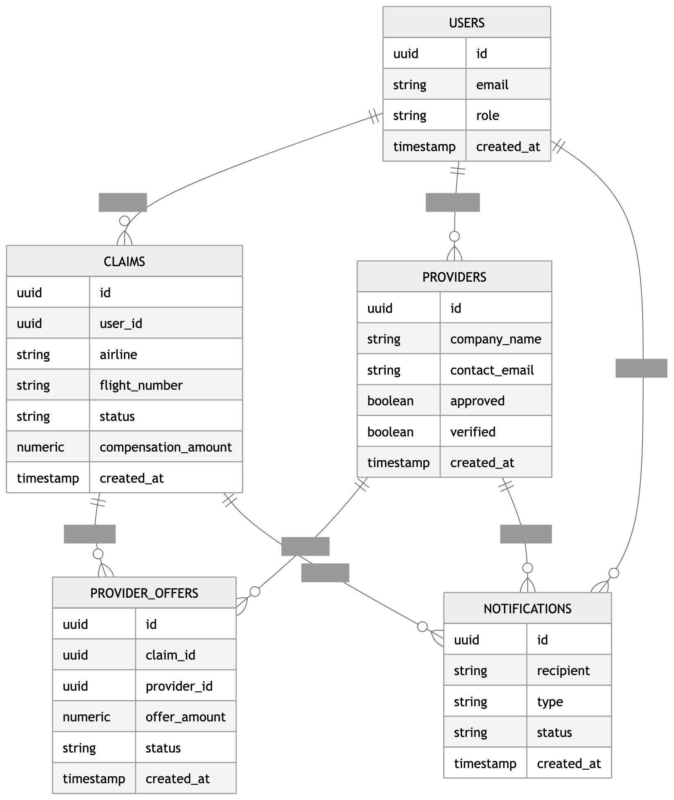

<p align="center">
  
</p>

<br>

<p align="center">
  
</p>

<h1 align="center">
Alejandro Baez
</h1>

<h3 align="center">
Founder of AirBid • Technology Entrepreneur • AI Marketplace Builder
</h3>

<p align="center">
Building the future of airline compensation through AI, automation, and marketplace innovation.
</p>

---


<div align="center">

# ✈️ AirBid

### The AI-Powered Flight Compensation Marketplace

🌐 https://airbid.app

Helping passengers recover compensation while approved providers compete for claims.

Building the world's first AI-operated flight compensation marketplace.

</div>

---
---

## 🚀 Featured Projects

<table>
<tr>
<td width="50%">

### ✈️ AirBid  
AI-powered flight compensation marketplace where approved providers compete for passenger claims.

**Status:** MVP in development  
**Focus:** Aviation • Marketplace • AI Automation  

</td>
<td width="50%">

### 📱 Nova Mobile  
Future MVNO concept for the Dominican Republic focused on accessible mobile service.

**Status:** Concept / Planning  
**Focus:** Telecom • Mobile • Dominican Republic  

</td>
</tr>
<tr>
<td width="50%">

### 🏢 Nova MultiService Solutions  
Business services brand focused on practical service solutions and future digital expansion.

**Status:** Active Brand  
**Focus:** Services • Operations • Business Support  

</td>
<td width="50%">

### 🎥 Stoic Verz  
Digital media brand focused on Stoic principles, storytelling, and educational content.

**Status:** Content Brand  
**Focus:** Media • Education • Storytelling  

</td>
</tr>
</table>
---

## ✈️ AirBid Visual Showcase

<p align="center">
  
</p>

AirBid is an AI-powered flight compensation marketplace designed to connect passengers with approved providers who compete to handle claims transparently and efficiently.

**Core workflow:** Passenger submits claim → approved providers receive notification → providers submit offers → passenger selects provider → claim lifecycle continues with automated updates.
---

# 🤖 AirBid AI Agent Headquarters

<p align="center">
  
</p>

AirBid is evolving beyond a traditional marketplace into an AI-assisted operating company designed to automate communication, operations, quality assurance, intelligence, and provider coordination.

## 🧠 Nexus

**Communication Orchestrator**

* Passenger notifications
* Provider notifications
* Email automation
* Lifecycle communications

## 🛡️ Sentinel

**Workflow Stabilizer**

* Workflow monitoring
* Failure detection
* Retry automation
* Operational alerts

## ✅ Guardian

**Quality Assurance & Testing**

* Workflow validation
* Regression monitoring
* Marketplace testing
* Platform reliability

## 🔮 Oracle

**Claim Intelligence**

* Claim analysis
* Compensation insights
* Provider matching support
* Data intelligence

## 🧭 Compass

**Marketplace Routing**

* Provider assignment
* Marketplace optimization
* Offer routing
* Selection workflows

### Future Vision


---

# 🏗️ AirBid Architecture Command Center

The AirBid platform is designed around marketplace automation, provider engagement, AI-assisted workflows, and scalable cloud infrastructure.

## Platform Architecture

<p align="center">
  
</p>

---

## Claim Workflow

<p align="center">
  
</p>

---

## Provider Marketplace Flow

<p align="center">
  
</p>

---

## AI Agent Ecosystem

<p align="center">
  
</p>

---

## Database Relationships

<p align="center">
  
</p>

### Architecture Goals

* Scalable marketplace infrastructure
* Automated provider communications
* AI-assisted workflow management
* Real-time claim lifecycle tracking
* Future autonomous operations
---

# 🛣️ AirBid Roadmap & Future Vision

AirBid is being built in phases, moving from marketplace MVP to AI-assisted operations and future international expansion.

## ✅ Completed

- AirBid brand foundation
- Passenger claim submission flow
- Provider marketplace concept
- Email notification system foundation
- GitHub founder profile setup
- Visual documentation system

## 🔄 In Progress

- Provider dashboard improvements
- Offer lifecycle fixes
- Passenger offer display improvements
- Approved provider workflow validation
- Marketplace dashboard synchronization
- Email notification reliability

## 🚀 Upcoming

- AI Communication Orchestrator
- Workflow Stabilizer Agent
- Investor-ready dashboard visuals
- Provider onboarding system
- US expansion planning
- Mobile application roadmap

## 🌍 Long-Term Vision

AirBid’s long-term goal is to become an AI-powered marketplace where passengers, approved providers, and automation agents work together to make airline compensation claims faster, more transparent, and more competitive.
AirBid is being developed as a marketplace platform capable of supporting international expansion, provider competition, and AI-driven operational automation.

Together these agents will coordinate the complete AirBid ecosystem, helping automate claim handling, provider engagement, passenger communications, and marketplace operations.
---

# 📈 Investor Corner

## The Problem

Millions of airline passengers experience delays, cancellations, missed connections, and denied boarding events every year. Many eligible passengers never file claims because the process is confusing, time-consuming, or they are unaware of their rights.

## The Solution

AirBid creates a transparent marketplace where approved compensation providers compete for passenger claims, giving passengers more choice while helping providers access qualified opportunities.

## Business Model

### Provider Subscriptions

Approved providers pay recurring subscription fees to participate in the marketplace.

### Marketplace Revenue

AirBid can generate additional revenue through marketplace fees, premium features, and future automation services.

## Competitive Advantages

* Marketplace-driven provider competition
* Transparent passenger experience
* AI-assisted operational workflows
* Scalable provider network
* International expansion potential

## Expansion Vision

### Phase 1

UK / EU Compensation Market

### Phase 2

United States Expansion

### Phase 3

Global Marketplace Ecosystem

## Long-Term Goal

Build the leading AI-assisted flight compensation marketplace connecting passengers and approved providers through transparency, competition, and automation.

# 🚀 About AirBid

AirBid is a marketplace connecting passengers affected by flight delays, cancellations, and disruptions with approved compensation providers.

Instead of passengers searching for providers, providers compete to win passenger claims.

---

# 🤖 AirBid AI Division

## 📧 Nexus

Communication Orchestrator AI

- Email monitoring
- Notification delivery
- Passenger communication tracking

---

## 🛠️ Sentinel

Workflow Stabilizer AI

- Workflow monitoring
- Failure detection
- Claim lifecycle tracking

---

## 🧪 Guardian

Quality Assurance AI

- System validation
- Workflow testing
- Data verification

---

## 🧠 Oracle

Claim Intelligence AI

- Claim analysis
- Compensation insights
- Provider intelligence

---

## 🎯 Compass

Marketplace Routing AI

- Provider matching
- Marketplace optimization
- Claim distribution

---

# ✈️ Marketplace Workflow

```text
Passenger
    ↓
Submit Claim
    ↓
AirBid Marketplace
    ↓
Approved Providers
    ↓
Offers Received
    ↓
Passenger Selects Provider
    ↓
Compensation Process
```

# 🛠 Technology Stack

- React
- TypeScript
- Supabase
- GitHub
- AI Agent Architecture
- Workflow Event Monitoring

---

# 🌎 Roadmap

### Phase 1

Marketplace MVP

### Phase 2

AI Agent Integration

### Phase 3

Autonomous Operations

### Phase 4

Global Expansion

---

# 🔗 Links

🌐 Website: https://airbid.app

💼 LinkedIn: https://www.linkedin.com/company/airbidmarketplace
